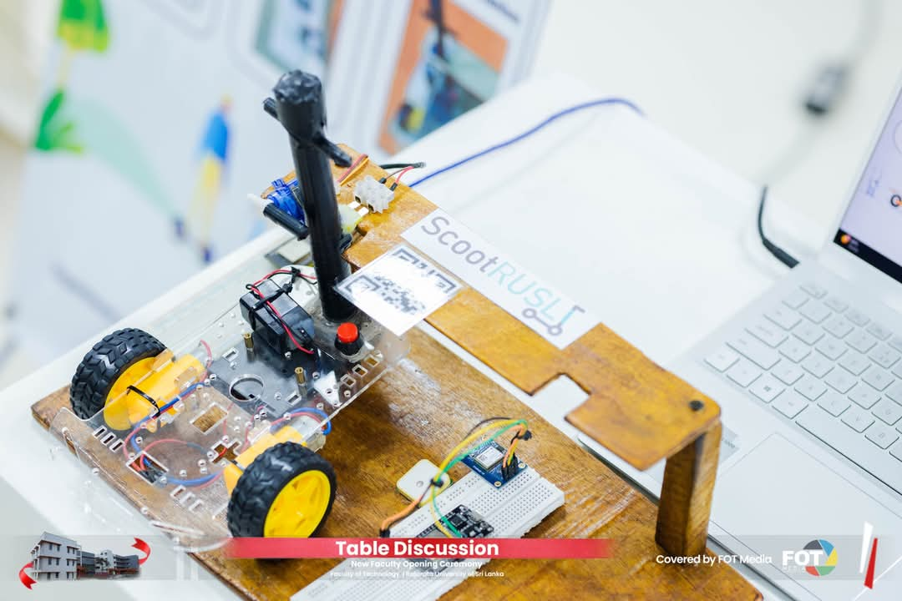
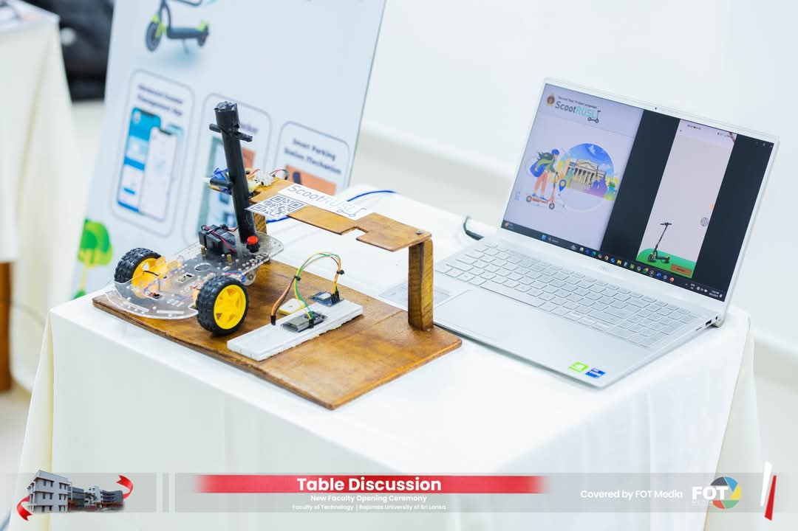
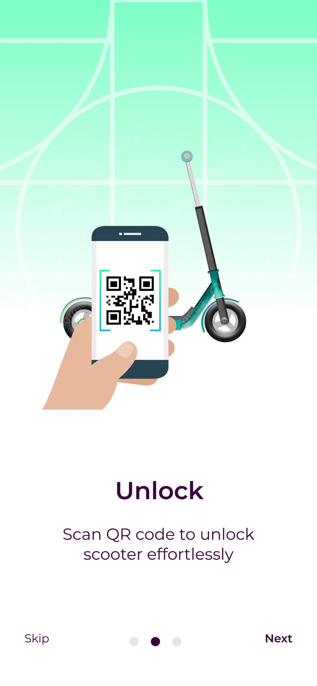

# 🛴 ScootRUSL - Scooter Management System

## Introduction
ScootRUSL is a smart scooter management system designed for students of Rajarata University of Sri Lanka. The system aims to solve the problem of low student participation in sports, lectures, and extracurricular activities due to the distance between hostels and university premises.

With ScootRUSL, students can hire and reserve kick scooters easily using a mobile application, reducing travel time and improving overall convenience. 🚀

## Screenshots & Images

## Problem Statement
The long distances between university premises and hostels result in reduced student participation in academic and extracurricular activities. The lack of convenient transport solutions forces students to spend excessive time commuting. 😕

## Proposed Solution
ScootRUSL provides a transport facility within the university premises, allowing students to book and unlock scooters via a mobile application. The system includes:
- Real-time scooter availability and tracking 📍
- Automated locking system using fingerprint or code entry 🔐
- Geo-fencing to ensure scooters remain within the university premises 🌍
- Fine system for unauthorized scooter use 💸

## Scope of the Project
### Functional Requirements
1. **User Registration & Login** - Secure student authentication using student ID 🔑
2. **Scooter Rental & Reservation** - Booking and unlocking via the app 🛴
3. **Scooter Tracking** - Real-time GPS tracking 📍
4. **Maintenance Tracking** - Automated issue reporting 🛠️
5. **Reporting** - Usage analytics and insights for administrators 📊
6. **User Management** - Admin control over user access and permissions 🧑‍💼

### Non-Functional Requirements
- **Security** (Two-factor authentication, encrypted data) 🔒
- **Reliability** (High availability and minimal downtime) ⚡
- **Performance** (Efficient handling of user requests) 🚀
- **Usability** (Simple and intuitive UI/UX) 📱
- **Scalability** (Supporting increased usage and future expansions) 📈
- **Accessibility** (Compatibility with various devices and disability-friendly design) ♿

## Technical Approach
### Hardware Components
- **GPS Module** - Tracks scooter location in real-time 📍
- **Arduino-based Locking System** - Fingerprint scanner and PIN entry 🖐️
- **Wi-Fi Module** - Data transmission to cloud servers 🌐

### Software Stack
- **Frontend:** Flutter (for mobile application UI/UX) 📱
- **Backend:** Firebase (authentication, database, cloud functions) 🔥
- **Database:** Cloud Firestore (real-time data storage) ☁️
- **APIs:** Google Maps API (navigation & tracking) 🗺️
- **Cloud Services:** Firebase Cloud Messaging, Cloud Functions, Cloud Storage ☁️

## Features
- **Secure Registration & Login** - Using student ID 🔑
- **QR Code Unlocking** - Scan and unlock scooters easily 📱
- **Live Tracking** - Monitor booked scooters in real-time 📍
- **Automated Notifications** - Alerts for reservations and violations 📧
- **Geo-fencing** - Prevents scooters from leaving university premises 🌍
- **User Rating System** - Feedback collection for service improvement ⭐

## Conclusion
ScootRUSL enhances student mobility within the university, saving time and improving participation in university activities. With its smart features and automation, it offers a seamless and efficient transportation solution for students. 🎓

---
GitHub Repository: [https://github.com/samaraEdirisooriya/Scoot-RUSL--Scooter-Management-System-.git]  
